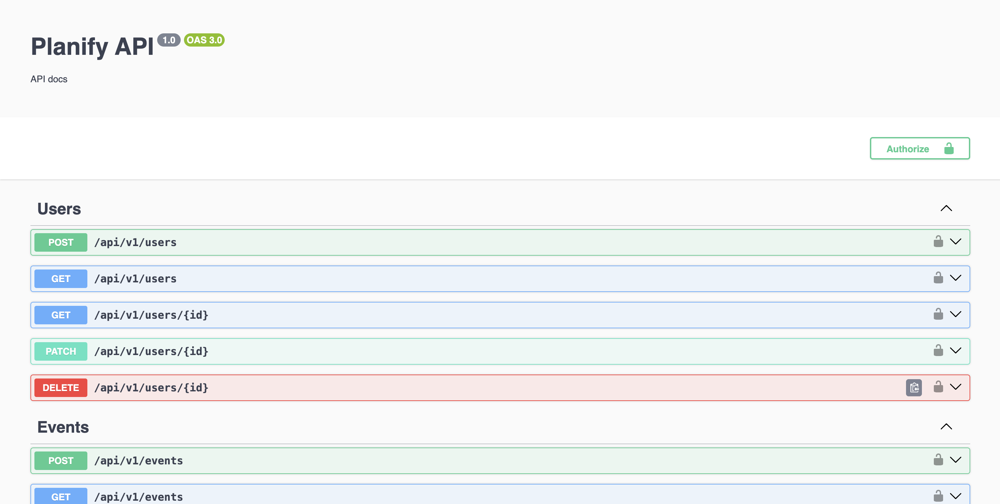
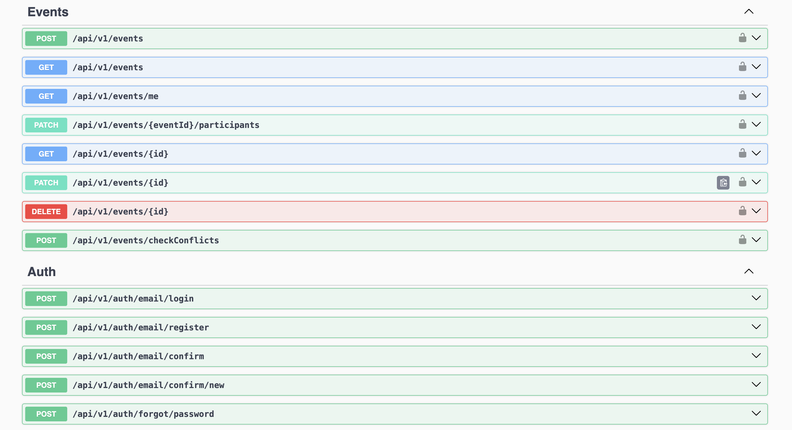

# Planify Backend

A robust NestJS backend application providing authentication, user management, event handling, and email capabilities. Built with TypeScript and follows clean architecture principles.

[](http://commitizen.github.io/cz-cli/)
[](https://www.typescriptlang.org/)
[](https://nestjs.com/)
[](https://opensource.org/licenses/MIT)




## Features

- 🔐 JWT Authentication and Authorization
- 👥 User Management System
- 📅 Event Management
- 📧 Email Service with Templates
- 🌐 Internationalization (i18n)
- 📝 TypeORM with Migration Support
- 🔄 Database Seeding
- 🧪 Comprehensive Testing Setup
- 🐳 Docker Integration
- 📊 Swagger API Documentation
- 🔍 ESLint + Prettier Code Quality
- 🔄 CI/CD with GitHub Actions
- 🚀 SWC Support for Faster Development

## Prerequisites

```bash
Node.js >= 16.0.0
npm >= 8.0.0
PostgreSQL
Docker (optional)
```
## Installation

1. Clone the repository:
```bash
git clone https://github.com/Doha26/planify-backend.git
cd planify-backend
```

2. Install dependencies:
```bash
npm install
```

3. Set up environment variables:
```bash
cp env-example .env
```

4. Configure your `.env` file with appropriate values.

## Running the Application

```bash
# Development (This launches the NestJS Backend on port localhost:3000 and the maildev client app on localhost:1080)
npm run start:dev

# Development with SWC (faster)
npm run start:swc

# Debug mode
npm run start:debug

# Production mode
npm run start:prod
```
## Preview 

- [localhost:3000 - Swagger Documentation](http://localhost:3000/swagger) - API documentation interface.
- [localhost:1080 - MailDev](http://localhost:1080) - Email testing tool.


## Database Migrations

```bash
# Generate a migration
npm run migration:generate -- src/database/migrations/[MigrationName]

# Create empty migration
npm run migration:create -- src/database/migrations/[MigrationName]

# Run migrations
npm run migration:run

# Revert migrations
npm run migration:revert

# Drop schema
npm run schema:drop
```

### Seeding

```bash
# Create a seed
npm run seed:create

# Run seeds
npm run seed:run
```

## Development Tools

### Code Generation

```bash
# Generate a new resource
npm run generate:resource

# Add property to existing resource
npm run add:property
```

### Code Quality

```bash
# Run ESLint
npm run lint

# Format code
npm run format
```

## Testing

```bash
# Unit tests
npm run test

# Watch mode
npm run test:watch

# Test coverage
npm run test:cov

# E2E tests
npm run test:e2e

# Debug tests
npm run test:debug

# E2E tests with Docker
npm run test:e2e:docker
```

## Docker Support

```bash
# Development environment
docker compose up

# Testing environment
docker compose -f docker-compose.test.yaml up

# CI environment
docker compose -f docker-compose.ci.yaml up
```

## Folder Structure

```
src/
├── auth/           # Authentication & authorization
├── config/         # Application configuration
├── database/       # Database setup & migrations
├── events/         # Event management
├── mail/           # Email service
├── users/          # User management
└── utils/          # Utility functions
```

## API Documentation

Once the application is running, you can access the Swagger documentation at:

```
http://localhost:3000/docs
```

## Dependency Updates

The project uses Renovate for automated dependency updates. Configuration can be found in `renovate.json`.

## Release Management

```bash
# Create a new release
npm run release
```

Release configuration is managed through `release-it` in package.json. The project follows semantic versioning.

## Additional Documentation

Detailed documentation is available in the `/docs` directory:

- [Architecture Overview](docs/architecture.md)
- [Authentication](docs/auth.md)
- [Testing Guidelines](docs/tests.md)
- [CLI Usage](docs/cli.md)

## Scripts Reference

| Script | Description |
|--------|-------------|
| `npm run start:dev` | Start the application in development mode |
| `npm run start:swc` | Start with SWC for faster development |
| `npm run test` | Run unit tests |
| `npm run test:e2e` | Run end-to-end tests |
| `npm run migration:run` | Execute database migrations |
| `npm run seed:run` | Run database seeds |
| `npm run lint` | Run ESLint |
| `npm run format` | Format code with Prettier |

## Environment Variables

Key environment variables needed (see env-example for complete list):

```bash
DATABASE_HOST=localhost
DATABASE_PORT=5432
DATABASE_USERNAME=postgres
DATABASE_PASSWORD=postgres
DATABASE_NAME=planify

JWT_SECRET=your-jwt-secret
JWT_EXPIRES_IN=1d

MAIL_HOST=localhost
MAIL_PORT=1025
MAIL_USER=user
MAIL_PASSWORD=password
```

## Complete Project Structure

```
|-- .env
|-- .gitignore
|-- .hygen.js
|-- .nvmrc
|-- .prettierrc
|-- Dockerfile
|-- LICENSE
|-- Procfile
|-- README.md
|-- commitlint.config.js
|-- docker-compose.ci.yaml
|-- docker-compose.test.yaml
|-- docker-compose.yaml
|-- docs
    |-- architecture.md
    |-- auth.md
    |-- cli.md
    |-- readme.md
    |-- tests.md
|-- e2e.Dockerfile
|-- env-example
|-- eslint.config.mjs
|-- maildev.Dockerfile
|-- nest-cli.json
|-- package-lock.json
|-- package.json
|-- renovate.json
|-- src
    |-- app.module.ts
    |-- auth
        |-- auth-providers.enum.ts
        |-- auth.controller.ts
        |-- auth.module.ts
        |-- auth.service.ts
        |-- config
            |-- auth-config.type.ts
            |-- auth.config.ts
        |-- dto
            |-- auth-confirm-email.dto.ts
            |-- auth-email-login.dto.ts
            |-- auth-forgot-password.dto.ts
            |-- auth-register-login.dto.ts
            |-- auth-reset-password.dto.ts
            |-- auth-update.dto.ts
            |-- login-response.dto.ts
            |-- refresh-response.dto.ts
        |-- strategies
            |-- anonymous.strategy.ts
            |-- jwt-refresh.strategy.ts
            |-- jwt.strategy.ts
            |-- types
                |-- jwt-payload.type.ts
                |-- jwt-refresh-payload.type.ts
    |-- config
        |-- app-config.type.ts
        |-- app.config.ts
        |-- config.type.ts
    |-- database
        |-- config
            |-- database-config.type.ts
            |-- database.config.ts
        |-- data-source.ts
        |-- migrations
            |-- 1736807938921-CreateUserAndEventEntities.ts
        |-- seeds
            |-- event
                |-- event-seed.module.ts
                |-- event-seed.service.ts
            |-- run-seed.ts
            |-- seed.module.ts
            |-- user
                |-- user-seed.module.ts
                |-- user-seed.service.ts
        |-- typeorm-config.service.ts
    |-- events
        |-- domain
            |-- event.ts
        |-- dto
            |-- add-participant.dto.ts
            |-- check-conflict.dto.ts
            |-- create-event.dto.ts
            |-- event.dto.ts
            |-- find-all-events.dto.ts
            |-- update-event.dto.ts
        |-- events.controller.ts
        |-- events.module.ts
        |-- events.service.ts
        |-- infrastructure
            |-- persistence
                |-- event.abstract.repository.ts
                |-- relational
                    |-- entities
                        |-- event.entity.ts
                    |-- mappers
                        |-- event.mapper.ts
                    |-- relational-persistence.module.ts
                    |-- repositories
                        |-- event.repository.ts
    |-- home
        |-- home.controller.ts
        |-- home.module.ts
        |-- home.service.ts
    |-- i18n
        |-- en
            |-- common.json
            |-- confirm-email.json
            |-- confirm-new-email.json
            |-- reset-password.json
    |-- mail
        |-- config
            |-- mail-config.type.ts
            |-- mail.config.ts
        |-- interfaces
            |-- mail-data.interface.ts
        |-- mail-templates
            |-- activation.hbs
            |-- confirm-new-email.hbs
            |-- reset-password.hbs
        |-- mail.module.ts
        |-- mail.service.ts
    |-- mailer
        |-- mailer.module.ts
        |-- mailer.service.ts
    |-- main.ts
    |-- session
        |-- domain
            |-- session.ts
        |-- infrastructure
            |-- persistence
                |-- relational
                    |-- entities
                        |-- session.entity.ts
                    |-- mappers
                        |-- session.mapper.ts
                    |-- relational-persistence.module.ts
                    |-- repositories
                        |-- session.repository.ts
                |-- session.repository.ts
        |-- session.module.ts
        |-- session.service.ts
    |-- social
        |-- interfaces
            |-- social.interface.ts
        |-- tokens.ts
    |-- users
        |-- domain
            |-- user.ts
            |-- users.json
        |-- dto
            |-- create-user.dto.ts
            |-- query-user.dto.ts
            |-- update-user.dto.ts
        |-- infrastructure
            |-- persistence
                |-- relational
                    |-- entities
                        |-- user.entity.ts
                    |-- mappers
                        |-- user.mapper.ts
                    |-- relational-persistence.module.ts
                    |-- repositories
                        |-- user.repository.ts
                |-- user.abstract.repository.ts
        |-- users.controller.ts
        |-- users.module.ts
        |-- users.service.ts
    |-- utils
        |-- deep-resolver.ts
        |-- dto
            |-- infinity-pagination-response.dto.ts
        |-- infinity-pagination.ts
        |-- relational-entity-helper.ts
        |-- request-context-middleware.ts
        |-- request-context-service.ts
        |-- request.context.module.ts
        |-- serializer.interceptor.ts
        |-- shared
            |-- current-user.decorators.ts
            |-- roles.decorator.ts
            |-- roles.enum.ts
            |-- roles.guard.ts
            |-- statuses.enum.ts
        |-- transformers
            |-- lower-case.transformer.ts
        |-- types
            |-- deep-partial.type.ts
            |-- index.d.ts
            |-- maybe.type.ts
            |-- nullable.type.ts
            |-- or-never.type.ts
            |-- pagination-options.ts
        |-- validate-config.ts
        |-- validation-options.ts
|-- startup.ci.sh
|-- startup.dev.sh
|-- startup.test.sh
|-- test
    |-- admin
        |-- auth.e2e-spec.ts
        |-- users.e2e-spec.ts
    |-- jest-e2e.json
    |-- user
        |-- auth.e2e-spec.ts
    |-- utils
        |-- constants.ts
|-- test.Dockerfile
|-- tsconfig.build.json
|-- tsconfig.json
|-- wait-for-it.sh

```
## License

This project is licensed under the MIT License - see the [LICENSE](LICENSE) file for details.