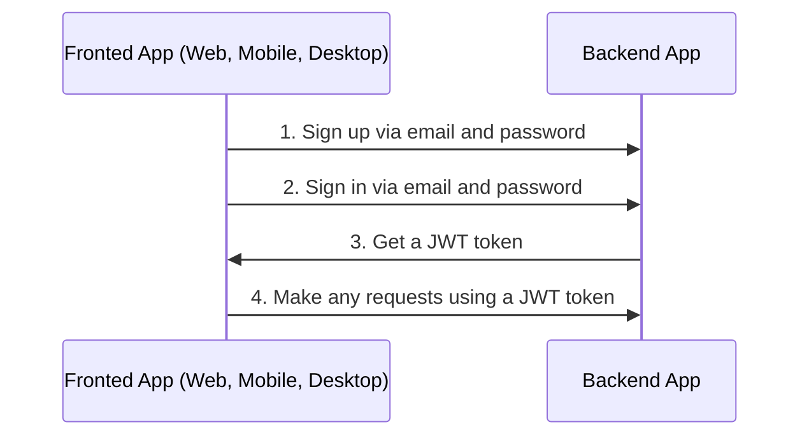
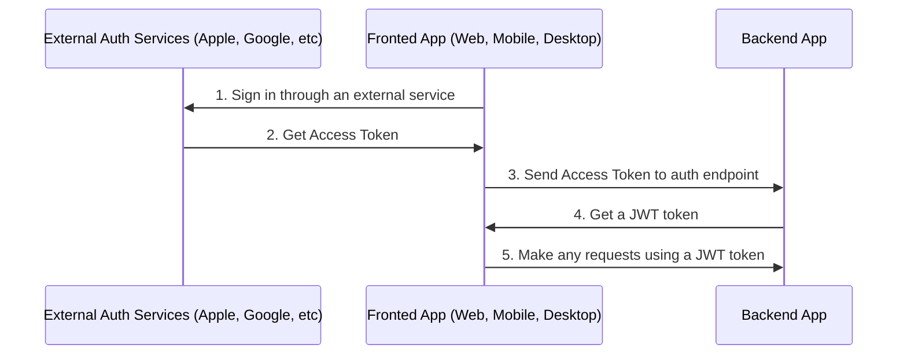

# Auth

## Table of Contents <!-- omit in toc -->

- [General info](#general-info)
  - [Auth via email flow](#auth-via-email-flow)
  - [Auth via external services or social networks flow](#auth-via-external-services-or-social-networks-flow)
- [Configure Auth](#configure-auth)
- [About JWT strategy](#about-jwt-strategy)
- [Refresh token flow](#refresh-token-flow)
- [Logout](#logout)

---

## General info

### Auth via email flow

By default boilerplate used sign in and sign up via email and password.



<https://user-images.githubusercontent.com/6001723/224566194-1c1f4e98-5691-4703-b30e-92f99ec5d929.mp4>

### Auth via external services or social networks flow

Also you can sign up via another external services or social networks like Apple, Facebook, Google, and Twitter.



For auth with external services or social networks you need:

1. Sign in through an external service and get access token(s).
1. Call one of endpoints with access token received in frontend app on 1-st step and get JWT token from the backend app.

   ```text
   POST /api/v1/auth/facebook/login

   POST /api/v1/auth/google/login

   POST /api/v1/auth/twitter/login

   POST /api/v1/auth/apple/login
   ```

1. Make any requests using a JWT token

---

## Configure Auth

1. Generate secret keys for `access token` and `refresh token`:

   ```bash
   node -e "console.log('\nAUTH_JWT_SECRET=' + require('crypto').randomBytes(256).toString('base64') + '\n\nAUTH_REFRESH_SECRET=' + require('crypto').randomBytes(256).toString('base64') + '\n\nAUTH_FORGOT_SECRET=' + require('crypto').randomBytes(256).toString('base64') + '\n\nAUTH_CONFIRM_EMAIL_SECRET=' + require('crypto').randomBytes(256).toString('base64'));"
   ```

1. Go to `/.env` and replace `AUTH_JWT_SECRET` and `AUTH_REFRESH_SECRET` with output from step 1.

   ```text
   AUTH_JWT_SECRET=HERE_SECRET_KEY_FROM_STEP_1
   AUTH_REFRESH_SECRET=HERE_SECRET_KEY_FROM_STEP_1
   ```

## About JWT strategy

In the `validate` method of the `src/auth/strategies/jwt.strategy.ts` file, you can see that we do not check if the user exists in the database because it is redundant, it may lose the benefits of the JWT approach and can affect the application performance.

To better understand how JWT works, watch the video explanation https://www.youtube.com/watch?v=Y2H3DXDeS3Q and read this article https://jwt.io/introduction/

```typescript
// src/auth/strategies/jwt.strategy.ts

@Injectable()
export class JwtStrategy extends PassportStrategy(Strategy, 'jwt') {
  // ...

  public validate(payload) {
    if (!payload.id) {
      throw new UnauthorizedException();
    }

    return payload;
  }
}
```

## Refresh token flow

1. On sign in (`POST /api/v1/auth/email/login`) you will receive `token`, `tokenExpires` and `refreshToken` in response.
1. On each regular request you need to send `token` in `Authorization` header.
1. If `token` is expired (check with `tokenExpires` property on client app) you need to send `refreshToken` to `POST /api/v1/auth/refresh` in `Authorization` header to refresh `token`. You will receive new `token`, `tokenExpires` and `refreshToken` in response.


## Logout

1. Call following endpoint:

   ```text
   POST /api/v1/auth/logout
   ```

2. Remove `access token` and `refresh token` from your client app (cookies, localStorage, etc).
